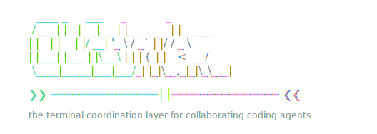
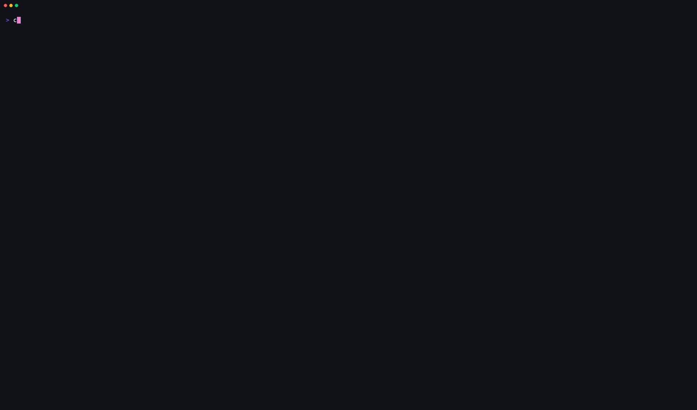
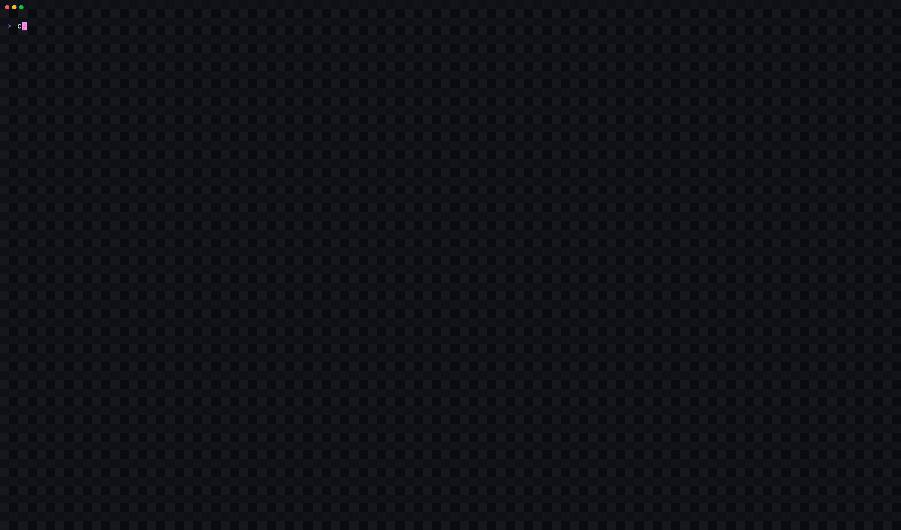
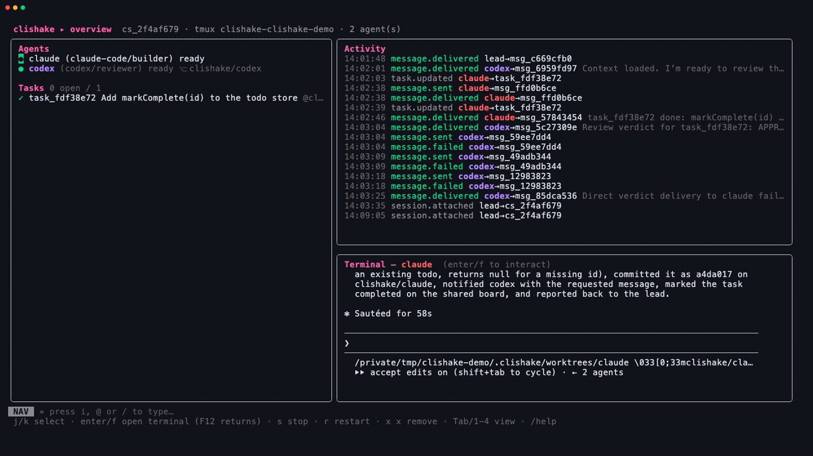

# CLIshake

<p align="center">
    <picture>
        <source media="(prefers-color-scheme: light)" srcset="docs/assets/clishake-banner-light.svg">
        
    </picture>
</p>

<p align="center">
  <a href="https://github.com/clishakehq/clishake/actions/workflows/ci.yml"></a>
  <a href="docs/adapters.md"></a>
  <a href="#the-dashboard"></a>
  <a href="docs/tmux.md"></a>
  <a href="https://github.com/clishakehq/clishake/releases/latest"></a>
  <a href="go.mod"></a>
  <a href="LICENSE"></a>
</p>

**CLIshake** (_CLI handshake_) lets one human team lead launch, observe,
coordinate, and control **many coding agents working concurrently on the
same codebase** — even when they run on different harnesses: Claude Code,
OpenAI Codex, OpenCode, GitHub Copilot CLI, or Antigravity CLI. It is not a window manager around terminals: it is an
actual coordination layer — identities, messaging, teams, tasks,
permissions, approvals, a durable audit log, and safe concurrent Git
workspaces — on top of tmux-managed agent terminals.

<p align="center">
  <a href="docs/architecture.md">Architecture</a> ·
  <a href="docs/adapters.md">Adapters</a> ·
  <a href="docs/tmux.md">Tmux model</a> ·
  <a href="docs/workspace-and-permissions.md">Teams &amp; permissions</a> ·
  <a href="docs/recovery.md">Recovery</a> ·
  <a href="CHANGELOG.md">Changelog</a> ·
  <a href="CONTRIBUTING.md">Contributing</a>
</p>

<p align="center">
  
</p>

<p align="center">
  <sub><em>One command — <code>clishake init</code> — opens the dashboard. Here, a real Claude Code builder and
  Codex reviewer collaborate on the same repo: overview → the shared chat → both live terminals side by side.
  Codex reviewed Claude's commit and approved it, all through CLIshake.</em></sub>
</p>

## Highlights

- **Five harnesses, one session** — Claude Code, Codex, OpenCode,
  Copilot CLI, and Antigravity, behind one honest adapter contract.
  New TUI harnesses are a config edit, not a fork.
- **Real coordination, not tiled terminals** — attributed messaging
  (`@name`, `@team:`, `@role:`, `@task:`, `@all`), a task board, shared
  live context files, approval gates, and an append-only audit log.
- **You stay the lead** — or delegate to a first-class coordinator
  agent that assigns, chases, and reports while approvals remain yours.
- **A dashboard that shows everything** — four views (overview, focus,
  grid of live terminals, filterable chat), per-agent colors, `@`
  autocomplete, harness permission dialogs answered with one key.
- **Safe concurrent Git** — a worktree and branch per editing agent by
  default; overlap detection; no silent overwrites, ever.
- **Disconnect-proof** — agents live in tmux, not in the dashboard.
  Close your laptop; reattach later; CLIshake reconciles and tells you
  what happened while you were away.
- **Per-agent model & permissions** — launch each agent on the model you
  want (`--model`) with a permission profile that stops mid-session
  re-prompts (`--permissions`); the folder-trust dialog is auto-answered.
- **Live model & usage** — see which model each agent is actually running
  and how much it has used, read from its status line; `/usage` rolls it
  up for the whole team.
- **Team-level commands** — `/loop` keeps the whole team working toward a
  shared goal until you stop it; `/goal`, `/usage`, `/clear`, and pass any
  harness slash command straight through with `@agent /command`.
- **Shared skills** — one `.clishake/skills/` set every agent gets,
  whatever its harness (installed natively where the harness supports it).
- **Natural language optional** — `clishake ask "spin up a reviewer
  team"` turns intent into a reviewed, whitelisted command plan.

## How it works

- Every agent runs as a real process inside a **dedicated tmux server**
  (socket `clishake`), one window per agent — your own tmux sessions are never
  touched. Detach at will; agents keep working.
- A **harness adapter** normalizes each agent CLI: how to launch it, deliver
  input (typed keys or structured inbox files), parse output, detect
  readiness/failure, and report *honest* capabilities.
- The orchestration core persists everything in `.clishake/state.db`
  (SQLite) and appends every state change to `.clishake/events.jsonl`
  (append-only audit log), so you can disconnect and reconnect without losing
  orchestration state.
- By default each editing agent gets its **own Git worktree and branch**
  (`clishake/<agent>`), so concurrent agents cannot silently overwrite each
  other; you integrate their branches when ready.

## Prerequisites

- **tmux ≥ 3.0** (required — CLIshake manages agent terminals with it)
- **Go ≥ 1.24** (to build)
- **git** (optional but recommended; enables per-agent worktrees)
- Coding-agent CLIs (all optional; the built-in `mock` adapter needs nothing):
  Claude Code, OpenAI Codex, OpenCode, GitHub Copilot CLI, Antigravity CLI

## Platform support

| Platform | Status |
|---|---|
| **macOS** (Apple Silicon & Intel) | Supported |
| **Linux** (x86-64 & ARM) | Supported |
| **Windows** | Not native — run under [WSL2](https://learn.microsoft.com/windows/wsl/), where it behaves exactly as on Linux |

CLIshake's orchestration core is built on tmux, which has no native Windows
equivalent — Windows lacks the Unix pty/process/signals model tmux depends on.
The supported path on Windows is **WSL2**, where CLIshake runs exactly as it
does on Linux. Native Windows would mean replacing the tmux backend wholesale;
it's a possible long-term direction, not a near-term commitment.

## Install

Homebrew (macOS + Linux/WSL):

```bash
brew install --cask clishakehq/clishake/clishake
```

Or with Go:

```bash
go install github.com/clishakehq/clishake/cmd/clishake@latest
```

or from source:

```bash
git clone https://github.com/clishakehq/clishake && cd clishake
make install        # builds and installs to /usr/local/bin
```

## Updating

No re-clone or re-fork needed. CLIshake checks GitHub for new releases once a
day (cached, offline-safe) and prints a one-line notice after any command when
a newer version is out. To upgrade in place:

```bash
clishake update         # upgrades in place (go install, or prints the source steps)
clishake version        # show the installed version and whether a newer one exists
clishake update --check # just look; don't install
```

`clishake update` re-runs `go install` against the newest tagged release (or,
if you have no Go toolchain, prints the `git pull && make install` steps). To
silence the background check, set `CLISHAKE_NO_UPDATE_CHECK=1`.

## Quick start

Run one command inside any project — it opens the dashboard, where you add
agents with `/add`, message them with `@`, and watch them work:

```bash
cd your-project
clishake init          # initializes .clishake/ and opens the dashboard
```

<p align="center">
  
</p>

In the dashboard: `/add claude claude-code builder`, `/add codex codex
reviewer`, then `@claude implement the login endpoint`. Everything the CLI
does is there — and everything the dashboard does is scriptable from the
CLI too:

```bash
clishake agent add builder --adapter mock --role builder --task "Build it"
clishake send @builder "work 3"     # direct message
clishake broadcast "status?"        # message every live agent
clishake messages                   # conversation history
clishake events -f                  # live activity stream
clishake                            # (re)open the dashboard
```

With real harnesses installed:

```bash
clishake agent add claude --adapter claude-code --role backend \
  --model opus --permissions auto \
  --task "Implement the API changes"
clishake agent add codex --adapter codex --role reviewer \
  --task "Review backend changes"
```

`--model` picks the harness model (e.g. `opus`, `sonnet`, `claude-fable-5`,
a Codex/Copilot model name); `--permissions` (`default`/`auto`/`full`/`plan`)
maps to each harness's own flags so agents stop re-prompting for approval. See
[docs/workspace-and-permissions.md](docs/workspace-and-permissions.md).

Every real agent is launched with a **session briefing** (identity, live
roster, how to message teammates via the CLIshake CLI) and with
`.clishake/context/` — session/roster/task files CLIshake keeps current —
to re-read at any time. Record shared decisions with:

```bash
clishake note "we're using worktree-per-agent; integration goes through the lead"
```

### Delegate coordination to an agent

```bash
clishake agent add coordinator --adapter claude-code --role coordinator \
  --task "Triage the backlog, assign tasks to the team, report to me"
```

The `coordinator` role is first-class: a coordination-focused briefing,
read-only workspace profile (it coordinates, it doesn't code), full
visibility of the task board and roster. You stay team lead — approvals
and integration remain yours. See
[docs/workspace-and-permissions.md](docs/workspace-and-permissions.md).

## The dashboard

`clishake` with no arguments opens the dashboard. Four views, switched
with **Tab** (or `1`/`2`/`3`/`4`):

1. **Overview** — agent/sub-agent tree with status, branch, and task; task
   summary; recent activity with attribution; live terminal preview of the
   selected agent.
2. **Focus** — one agent, full screen: header plus its live terminal,
   updated every second (status details when it has no terminal).
3. **Grid** — up to six live agent terminals side by side (1×1 → 2×3
   depending on count), so you can watch the whole team work at once. j/k
   moves the selection; the highlighted agent is the one `enter`/`f`/`s`/`r`
   act on.
4. **Chat** — the full conversation: every message between the lead and
   agents and between agents, with attribution, task annotations, and
   broadcasts collapsed to one `sender → all` entry — color-coded per
   agent. Scrollable (j/k line, pgup/pgdn page, g oldest, G latest, with a
   position indicator) and filterable in place: **filter chips** under the
   title — everything / broadcasts / lead / one chip per agent — switched
   with `h`/`l` (or `←`/`→`), filtering instantly. Shows the last 500
   messages.

The footer badge always shows which mode you are in: **NAV** (keys select
and control agents) or **INPUT** (keys type into the message line — `i`,
`@`, or `/` enters it; `esc` leaves). Typing `@` opens an **autocomplete
bar** of everything addressable — agents, `@team:`s, `@role:`s, open
`@task:`s, `@all` — filtered as you type (`↑`/`↓` select, `Tab`
completes). Each agent gets a stable accent color used everywhere it
appears — tree, grid headers, activity attribution, chat, filter chips —
so you can track who is who at a glance.

When a harness shows a first-run dialog (folder trust, tool approval), the
agent gets a **⚠ needs input** badge and you answer it right from the
dashboard: `a` accepts the highlighted option, `A` picks the second
(usually "always allow/remember"), `d` dismisses — no attaching required.

| Input | Effect |
|---|---|
| `@builder <text>` | message one agent |
| `@role:reviewer <text>` | message all agents with a role |
| `@team:core <text>` / `@all <text>` | team / broadcast |
| `@agent /command` | pass a harness slash command through (e.g. `@claude /compact`) |
| `/ask <intent>` | natural language → plan overlay, `y` to run (multi-line: `alt+enter`) |
| `/add <name> [adapter] [role]` | spawn an agent |
| `/loop <task>` · `/loop stop` | team loop: keep everyone working toward a goal |
| `/goal <text>` | set & broadcast a shared team goal |
| `/usage` | roll up every agent's live model and usage |
| `/clear` | hide prior dashboard activity |
| `/stop`, `/restart`, `/remove <name>` | lifecycle control |
| `/task <title>` · `/assign <task-id> <agent>` | task board |
| `/grant <id>` · `/deny <id>` | approval decisions |
| `/set <agent> role\|team <value>` | re-cluster a live agent (`-` clears) |
| `/note <text>` | append a shared note to the session context |
| `/help` | full command/key reference (overlay) |
| keys: `Tab`/`1`-`4` switch view · `j/k` select/scroll · `h/l` chat filter · `a`/`A`/`d` answer dialogs · `enter`/`f` focus agent terminal (**F12** returns to the dashboard) · `s` stop · `r` restart · `x x` remove · `q` quit |

Quitting the dashboard leaves agents running; `clishake` again reattaches and
reconciles.

## CLI reference

| Command | Purpose |
|---|---|
| `clishake` | start/attach the interactive dashboard |
| `clishake init` | initialize `.clishake/` and open the dashboard (`--no-open` to skip) |
| `clishake status` | session summary + reconcile report |
| `clishake agents` | agent tree (parents and sub-agents) |
| `clishake agent add <name> --adapter A --role R --task T [--model M] [--permissions P] [--no-start]` | register (+start) an agent |
| `clishake agent start\|stop\|restart\|remove <name>` | lifecycle |
| `clishake agent set <name> --role R --team T` | re-cluster a live agent |
| `clishake agent focus <name>` | jump to the agent's tmux window |
| `clishake send <@selector> <msg> [--task ID] [--reply-to MSG]` | message agents |
| `clishake broadcast <msg>` | message all live agents |
| `clishake task create --title T [--assign A] [--priority N] [--depends-on IDs]` | create task |
| `clishake task assign <task-id> <agent>` / `task update <id> --status S` | task board |
| `clishake tasks` / `clishake messages [--with A]` | boards & history |
| `clishake loop <task> \| stop \| status` | team loop toward a shared goal |
| `clishake skills [sync]` | list shared team skills / re-install into agents |
| `clishake logs <name> [-n N] [--raw]` | rendered agent terminal (live) / sanitized log |
| `clishake note <text>` | append an attributed note to the shared context |
| `clishake events [-n N] [-f] [--json]` | shared audit log |
| `clishake approvals [grant\|deny <id>]` | approval gates |
| `clishake ask "<intent>" [--dry-run] [--yes]` | natural language → reviewed plan of CLIshake commands |
| `clishake attach` | attach the managed tmux session |
| `clishake doctor` | diagnose tmux/adapters/config/state health |
| `clishake clean` | close orphan tmux windows no agent owns |
| `clishake stop [--kill-session]` | stop all agents (optionally the session) |

Selectors: `@name` (exact name, falls back to role then team), `@role:<r>`,
`@team:<t>`, `@task:<task-id>` (the task's owner + contributors), `@all`.
Terminal-status agents are excluded except by exact name. Re-cluster live
agents anytime with `clishake agent set <name> --role R --team T` — group
selectors resolve against current roles/teams on every send.

### Talk to CLIshake in natural language

```bash
clishake ask "spin up a reviewer and have it inspect the auth changes"
```

<p align="center">
  
</p>

`ask` uses a locally installed AI CLI (`claude -p`, falling back to
`codex exec`) to translate your intent into CLIshake commands from a fixed
whitelist. It **always shows you the plan first** — the exact commands and
the model's rationale — and runs nothing without your confirmation
(`--dry-run` to only look, `--yes` to skip the prompt). No API keys or new
dependencies: it reuses the harness CLIs you already have.

## Run the demo

The full 14-stage MVP demonstration (two mock agents, tasks, agent-to-agent
messaging, sub-agent discovery, broadcast, disconnect/reconnect, stop/restart,
failure recovery, audit trail) runs unattended:

```bash
demo/demo.sh              # uses an isolated temp dir + private tmux socket
KEEP=1 demo/demo.sh       # keep it around; then: tmux -L clishake-demo-<pid> attach
```

## Tests

```bash
go test ./...                          # unit tests (tmux/harness mocked)
CLISHAKE_TMUX_ITEST=1 go test ./...    # + real-tmux integration tests
```

No test requires paid API access.

## Documentation

- [Architecture](docs/architecture.md) — components, events, state, data flow
- [Adapters](docs/adapters.md) — the harness contract & how to add one
- [Tmux model](docs/tmux.md) — sockets, sessions, panes, attach/detach
- [Workspaces & permissions](docs/workspace-and-permissions.md) — Git strategy, permission model, approvals
- [Recovery & troubleshooting](docs/recovery.md) — persistence, reconcile, known limitations
- [Releasing](docs/RELEASING.md) — how tagged releases publish binaries + the Homebrew cask
- [Example config](examples/config.toml)

## Design principles

Reliability, observability, explicit state, recoverability, extensibility,
minimal vendor coupling, terminal-native operation, safe concurrent work,
**accurate capability reporting** (CLIshake never claims a harness feature the
active adapter cannot deliver), and clear human control with auditable
actions.

## Contributing

Issues and PRs welcome — see [CONTRIBUTING.md](CONTRIBUTING.md) for setup,
the test/demo commands, and the project's load-bearing principles.
Security reports: see [SECURITY.md](SECURITY.md).

## Contact

- Web: [clishake.dev](https://clishake.dev)
- Email: [hello@clishake.dev](mailto:hello@clishake.dev)

## License

[MIT](LICENSE) © The CLIshake Authors
